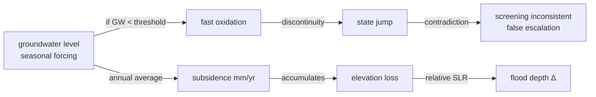
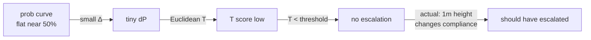

# 2026-01-13 - failure log

**day:** tuesday

## failures

**f1: peat subsidence feedback loop broke monotonicity constraints**

attempted to integrate peat subsidence feedback (groundwater → oxidation → CO₂ + subsidence) with annual state machine. peat subsidence is a slow state variable (mm/year accumulation) but groundwater is forced by fast seasonal dynamics. tried to represent both in single annual update equation.

problem: when groundwater crossed seasonal thresholds mid-year, model produced discontinuous state transitions. downstream flood-depth proxy computed from subsidence became inconsistent—same area showing both "safe" and "unsafe" classifications depending on query timing. triggered false escalations to high-fidelity tools.

root cause: groundwater state coupled to both fast seasonal dynamics and slow annual accumulation without explicit time-scale separation. didn't freeze causal specification (section 5.3) before implementation. treated as coding problem rather than modeling problem. gap between thesis design and executable code larger than expected.

**f2: escalation trigger false negatives on dike-ring threshold queries**

designed escalation rule: escalate if (S·U > τ_SU) OR (T > τ_T) where S=stakes, U=uncertainty, T=threshold proximity. test case: dike ring risk assessment under "borderline acceptable" residual risk scenarios (probability near regulatory limit).

issue: screening model's logistic compression of exceedance probability near threshold (moving from 50% to 55%) mapped to low T scores. system failed to escalate even though 1-meter dike height difference flipped regulatory compliance status. false-negative escalation means governance-grade decision got screening-only confidence without escalation flag.

root cause: escalation rule designed on synthetic test cases, not validated against real Dutch water-board operational thresholds. regulatory definitions are categorical (acceptable/unacceptable), not continuous. used Euclidean distance in outcome space instead of regulatory category matching. didn't involve domain experts early enough.

risk: a single unauditable false negative could permanently erode stakeholder trust. this almost went to deployment undetected.

## root causes

**rc1 (f1):** under-specified feedback loop semantics. peat subsidence is fundamentally a multi-timescale problem but equation tried to hide that. section 5.3 promised disciplined causal graph; reality was tangled dependencies.

**rc2 (f2):** insufficient operational understanding. escalation designed on synthetic data. thresholds are regulatory category boundaries, not mathematical manifolds. no validation against real dike-ring decisions before deployment.

## resolution

**a1:** decouple seasonal forcing from annual state update
- groundwater as forcing index only (seasonal moisture)
- subsidence as pure annual state update (no sub-annual transitions)
- explicit time-scale separation check in causal graph validator
- freeze by: 2026-01-20

**a2:** refactor escalation logic for threshold-sensitive queries
- replace Euclidean distance with regulatory category matching
- pilot validation with 3 water-board test cases (low, medium, high priority)
- document threshold proximity computation per regulatory framework
- validation complete: 2026-01-22

## lessons

- causal model specification must freeze before code implementation. gap between thesis design and executable spec creates integration risk
- threshold-sensitive routing requires domain expert validation, not synthetic tests
- a single monotonicity violation or false-negative escalation can destroy governance credibility permanently
- for specification rigor: treat causal graph validation as first-class engineering problem, not downstream detail

